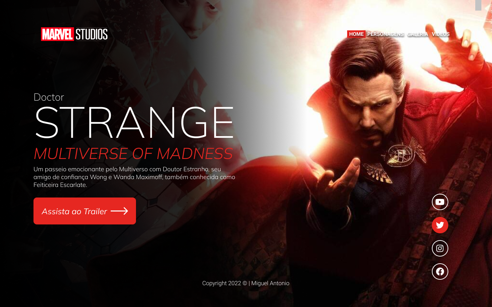
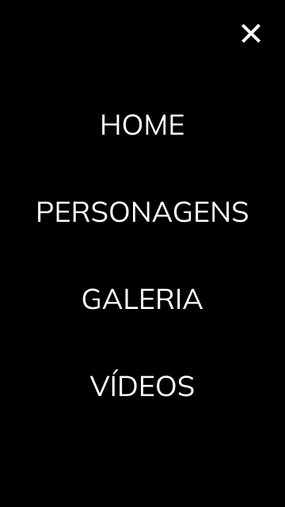

# project-strange

Projeto construído durante as aulas de LIMA no curso de Desenvolvimento de Sistemas do [SENAI Jandira](https://jandira.sp.senai.br/), com orientação do Prof. [Fernando Leonid](https://github.com/fernandoleonid).

---

## Qual era o objetivo do projeto?

O objetivo era criar uma landing page com base no design feito no figma, aprendendo a estrutura HTML, CSS, JS e conceitos de responsividade.

---
## O que é uma Landing Page?

Landing Pages são páginas com foco principal na conversão de visitantes, assim, essas páginas possuem uma estetica minimalista comparada com os sites tradicionais.

---
## Tecnologias usadas
- HTML 5
- CSS 3
- Javascript
- [figma](https://www.figma.com/)

---
## Links
- [Resultado](https://miguelbre.github.io/project-strange/)
- [Projeto figma](https://www.figma.com/file/pCgthYmPYjQqChlSy9JH67/Figma---Dr.-Strange2?node-id=0%3A1)
- [Código](https://github.com/MiguelBre/project-strange)

---
## Autor
[Miguel Bressan](https://github.com/MiguelBre)
